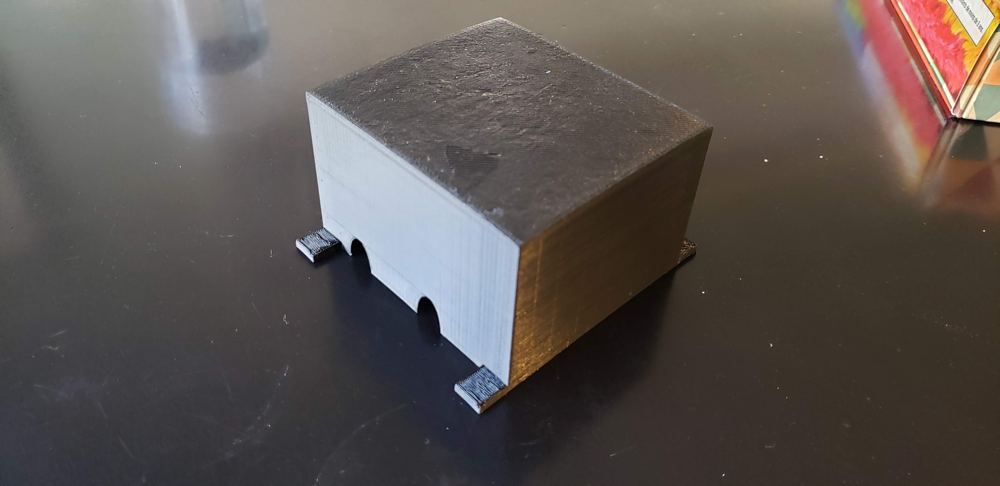
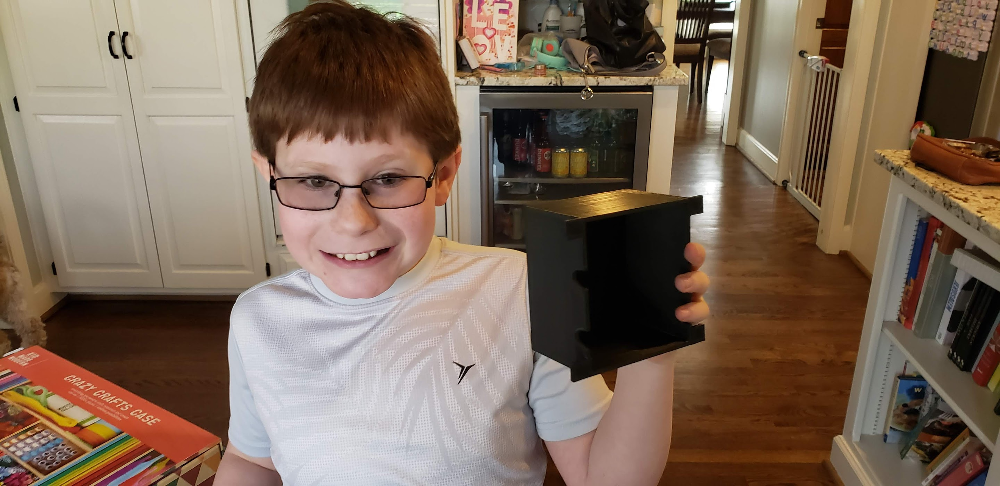
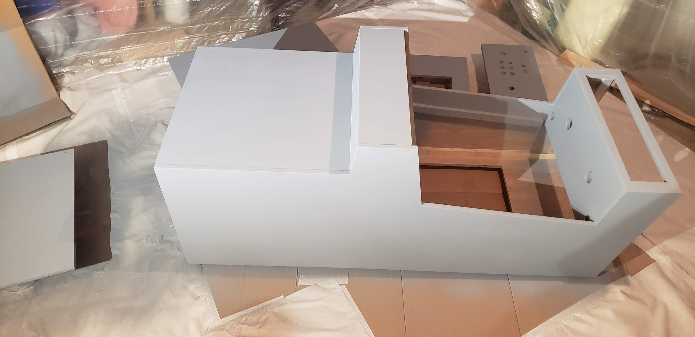
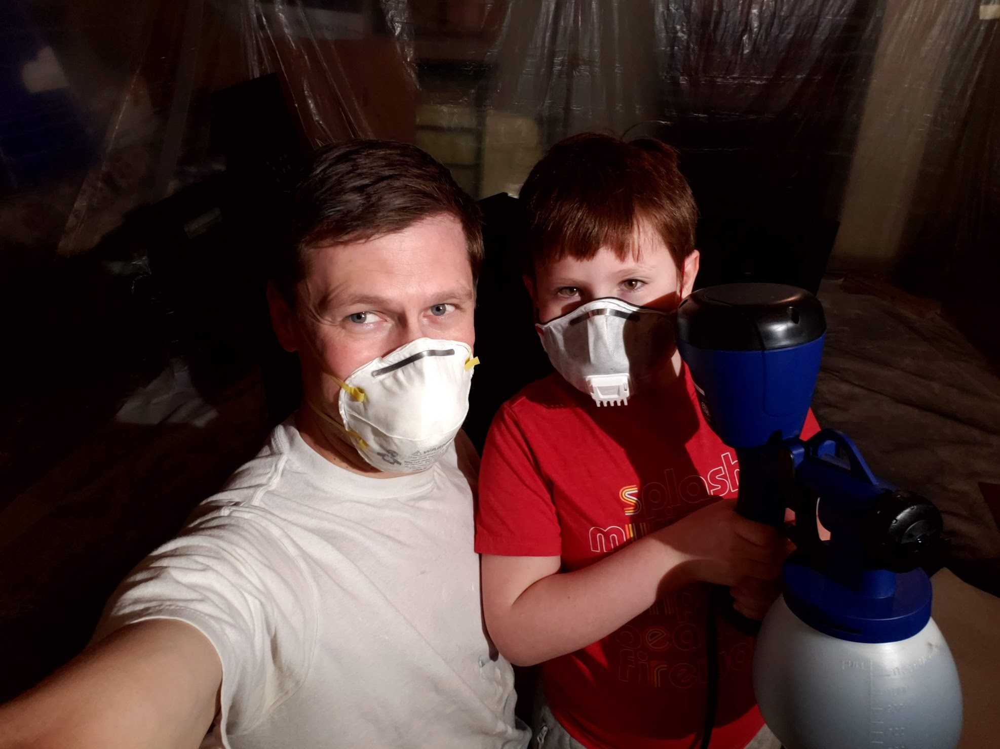
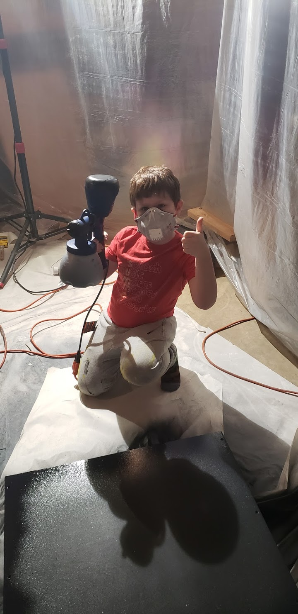
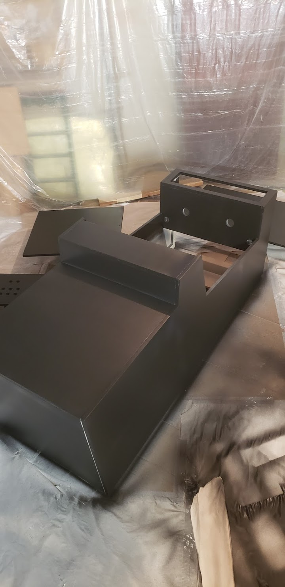
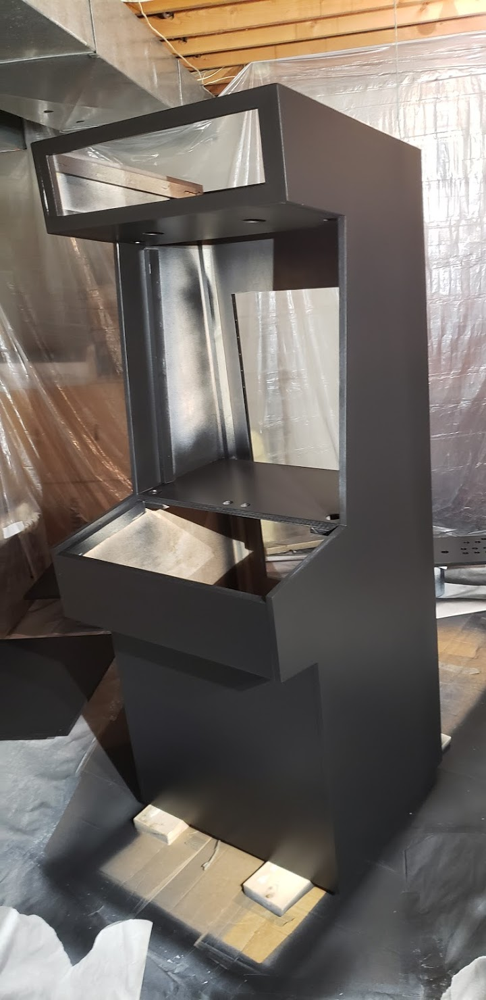

# StarCade

## Episode 1: The Makers Awaken

I was looking for a fun father/son project that I could work with my bright, tech-minded then 8 year old when I stumbled upon the work of Bob Clagett @ _I Like to Make Stuff_.  His impressive series on [How to Make An Arcade Cabinet](https://www.iliketomakestuff.com/how-to-make-an-arcade-cabinet-part-1/) inspired me to take on my own version of this classic 80's throwback.  So, fresh off of binge watching the entire Star Wars(TM) franchise with my young apprentice, our theme was immediately obvious: **StarCade** - a space themed battle station complete with lighted marquee, animated LED-powered lightsabers, LED ambient backlighting, specialized sound effects, and even a working Death Star that you can fire on-demand!  (Ok, so we went a little overboard with the special effects, but it's hard to contain an 8-year-old's imagination!)

StarCade is powered by a Raspberry Pi running the fantastic [RetroPie Emulator](https://retropie.org.uk/) for core gaming functions, and an Arduino Mega to run all the special effects.  Eventually I may get around to posting our basic plans for this build, but for now I'm at least sharing the source code for anyone who may want learn from our work.  This repository contains the main business logic, and I've also created a lightweight [SimpleAnimation](https://github.com/sgsiebers/SimpleAnimation) library to model the timed sequences of commands that run all the special effects.

This is still very much a work in progress.  Hopefully you won't have to wait years to see the final result!  For now, the 3D model we built will have to serve as a placeholder for the real thing.

# Progress Updates

## 6/12/2018: Lightsaber Prototype
These fun accents are made from [NeoPixel strips](https://www.amazon.com/ALITOVE-Individually-Addressable-Flexible-Waterproof/dp/B00VQ0D2TY) threaded trough a frosted acrylic tube and animated using my [SimpleAnimation](https://github.com/sgsiebers/SimpleAnimation) library.  Sound effects are coordinated by the Arduino triggering pins on an [Adafruit Mini Sound Board](https://www.amazon.com/Adafruit-Audio-Mini-Sound-Board/dp/B01GQFVV2I).  I also wired up a simple passive audio mixer so the Raspberry Pi and Sound Fx board could both drive the same speaker output.  Here's a great [example](https://www.instructables.com/id/Altoids-Tin-18-Stereo-Mixer/) of how you can make one yourself, although mine is much more crude.  I simply hacked the ends off some old Aux cables, soldered the resistors, taped it up, and stuffed it into a random plastic container.

It's pretty cool to see them in action, but for the complete experience with sound [watch this!](https://youtu.be/m8hfb_nRrew)

## 11/1/2018: Electronic Design
Ok, if I'm really going to pull off all the crazy special effects that my apprentice has envisioned, I needed a more detailed plan for how it's all going to fit together.  Here's a high-level wiring diagram for all the electronics I'm going to need:

## 11/29/2018: Coding Special Effects
My young apprentice has been busy helping me code a fairly complex LED animation sequence that will play when you "fire the Death Star" from an auxiliary button.  Check out our [bench test video!](https://youtu.be/5v-LOUCcdTg).  Also, here's a quick shot playing with the RetroPie emulator:

## 1/4/2019: Arcade Controls Prototype
We prototyped the control deck this week, wiring up the game buttons and joystick to an [I-PAC2](https://www.ultimarc.com/control-interfaces/i-pacs/i-pac2/) USB button encoder.  My daughter has decided she wants to join in the fun, so here's a shot of her taking the controls for a test drive:

## 12/1/2019: Cabinet Construction Begins
We've been on quite a long hiatus, distracted by kids, travel, and a new puppy, but as the weather turns cold again, we are finally finding the time to refocus on StarCade.  Next up, the cabinet.  Here are several pics as the design takes shape.

## 1/11/2020: Test Fitting Components
We've spent the last few weeks installing componentry in the cabinet and getting it ready for a test run.  We mounted the acrylic tubes for the lightsabers, drilled out holes for the control deck, and mounted the screen, control board, and speakers.  We are finally to the point where you can kind of play  it (using an old USB control pad for now).

## 1/25/2020: Marquee Design
With the cabinet construction wrapping up, it's time to get going on the marquee.  Although I'm not the most talented with an image editor, I was able to use GIMP to cobble together a fairly basic design that doesn't look half bad.  We had this printed on the back of an acryllic plastic sheet and it slides right into place in the top of the cabinet.

We also created a backlight for the marquee by chopping up a cheap [strip of white LED lights](https://www.amazon.com/Ustellar-Dimmable-Daylight-Lighting-Non-Waterproof/dp/B075RYSHQQ), attaching them to a thin piece of scrap plywood, and soldering it all together in parallel.  The backlight is controlled via relays wired into the Arduino so we can switch it on and off as needed.  

Upon testing, the only problem is that the backlight is way too bright relative to the light transmittance of the marquee printing, so it washes out the design when lit up (even when dimmed to the minimum setting).  I'm still trying to figure out what we'll do about this.  Perhaps we'll only light up the marquee during special animation sequences, or I'm considering spraying a light coating of paint on the back of the marquee to make it more opaque.

## 2/15/2020: Safety First
As you might have noticed in our wiring diagram, we are using the Arduino to switch relays feeding power to the LCD monitor which means having 120V power exposed on the control board.  To ensure the interior of the cabinet remains safe against accidental touches, my apprentice used Tinkercad to design a simple enclousure that we will mount over the top of the relays with small cutouts for the wiring to pass in and out.  A few hours of 3D printing later, and Viola, the exact size and shape we need. 

## 2/22/2020: Paint it Black
After a few quick coats of paint this weekend, suddenly our little project is starting to look like the real deal!  I bought a relatively affordable [HVLP Paint Spray Gun](https://www.amazon.com/HomeRight-C800971-Painter-Painting-Projects/dp/B071X9FZ7R) online and hung plastic from the celing in my basement to create a makeshift paint studio, then set to work.  I was suprised how well the sprayer handled both primer and latex paint (Sherwin Williams) with no thinning necessary.  My young apprentice even strapped on a mask to lay down a few layers of his own.  We'll let this cure for a couple of weeks to get a nice strong finish before moving on to futher finish work.

